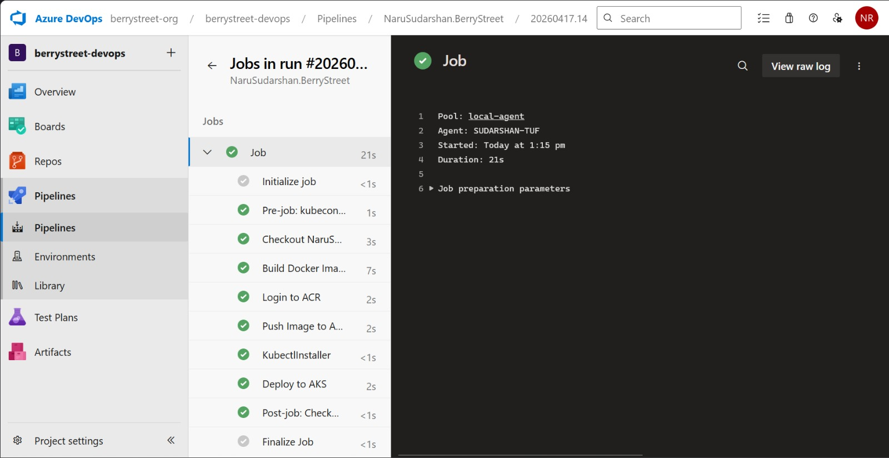
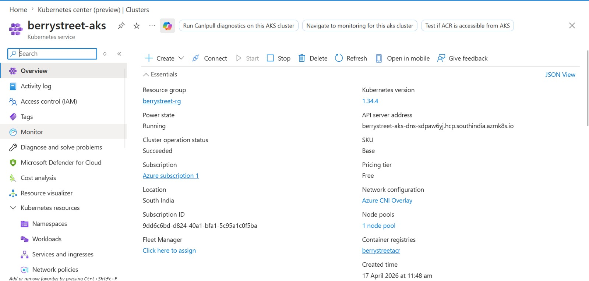
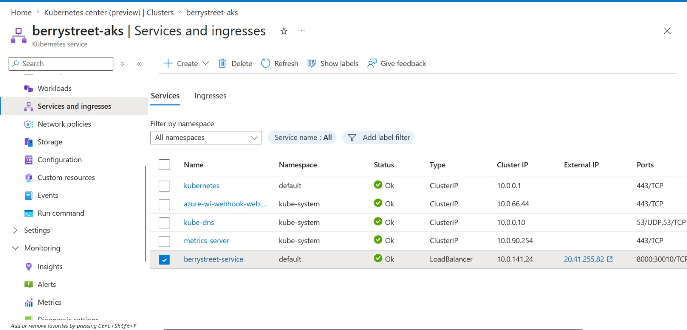
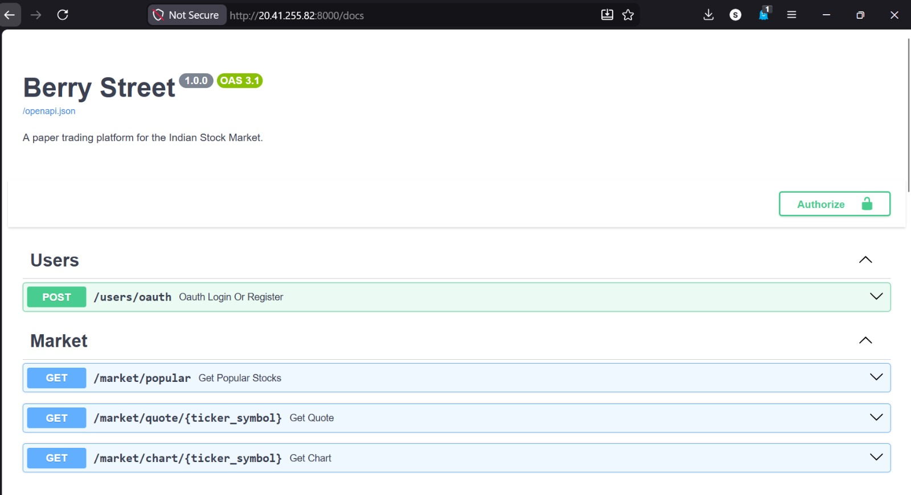

# 🚀 Berry Street — Cloud-Native Paper Trading Platform

A production-grade **FastAPI backend** deployed on **Azure Kubernetes Service (AKS)** with a fully automated **CI/CD pipeline using Azure DevOps**.

This project demonstrates real-world DevOps practices: containerization, Kubernetes orchestration, private registry usage, and automated deployments.

---

## 🧠 What This Project Demonstrates

- End-to-end cloud deployment (AKS)
- CI/CD automation using Azure DevOps
- Docker-based containerization
- Kubernetes deployments & services
- Private image registry integration (ACR)
- Real-world debugging (image pull, auth, pipeline issues)

---

## 🏗️ System Architecture

```
           ┌──────────────┐
           │   GitHub     │
           └──────┬───────┘
                  │ (push)
                  ▼
        ┌─────────────────────┐
        │ Azure DevOps CI/CD  │
        │  - Build Image      │
        │  - Push to ACR      │
        │  - Deploy to AKS    │
        └─────────┬───────────┘
                  │
                  ▼
        ┌─────────────────────┐
        │ Azure Container     │
        │ Registry (ACR)      │
        └─────────┬───────────┘
                  │
                  ▼
        ┌─────────────────────┐
        │ AKS Cluster         │
        │  - Pods (FastAPI)   │
        │  - Service (LB)     │
        └─────────┬───────────┘
                  │
                  ▼
              🌍 User
```

---

## ⚙️ Tech Stack

### Backend
- FastAPI
- SQLAlchemy
- SQLite
- Pydantic
- yfinance

### DevOps & Cloud
- Docker
- Kubernetes (AKS)
- Azure Container Registry (ACR)
- Azure DevOps Pipelines
- Self-hosted agent

---

## 🔄 CI/CD Pipeline Flow

1. Push code to GitHub  
2. Pipeline triggers automatically  
3. Docker image is built  
4. Image is pushed to ACR  
5. Kubernetes manifests are applied  
6. AKS updates running pods  

---

## 📦 Core Features

- 🔐 JWT-based authentication  
- 💰 Virtual trading wallet (₹1,00,000)  
- 📊 Real-time stock data (yfinance)  
- 📈 Buy/Sell simulation  
- 📁 Portfolio tracking  
- 🔁 Transaction-safe operations  

---

## 🐳 Docker Usage

Build image:

```
docker build -t berrystreet-api .
```

Run container:

```
docker run -p 8000:8000 berrystreet-api
```

---

## ☸️ Kubernetes Deployment

```
kubectl apply -f k8s/
```

Verify:

```
kubectl get pods
kubectl get svc
```

---

## 📸 Screenshots

### ✅ CI/CD Pipeline


### ✅ AKS Deployment


### ✅ Service Exposure


### ✅ Container Registry


### ✅ Swagger UI


---

## 🧪 Run Locally

```
python -m venv .venv

# Windows
.venv\Scripts\activate

# Linux/macOS
source .venv/bin/activate

pip install -r requirements.txt
fastapi dev app/main.py
```

---

## 📖 API Documentation

- `/docs` → Swagger UI  

---

## ⚠️ Note

Azure resources were cleaned up after development to avoid costs.  
The project remains fully reproducible using the provided configuration.

---
